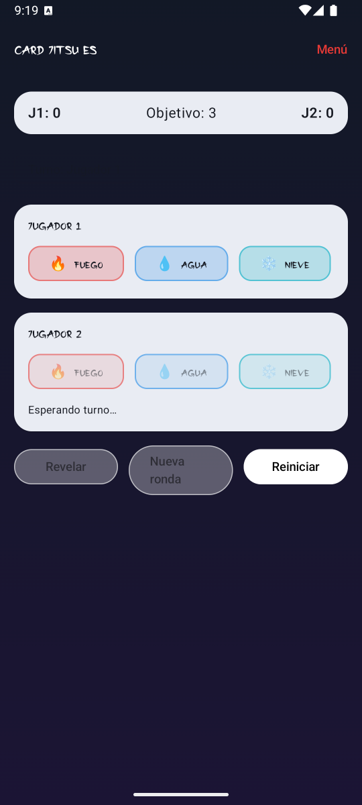
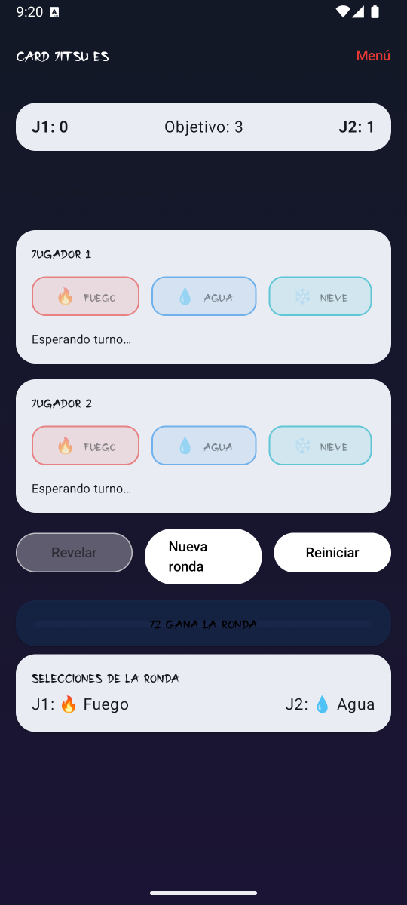
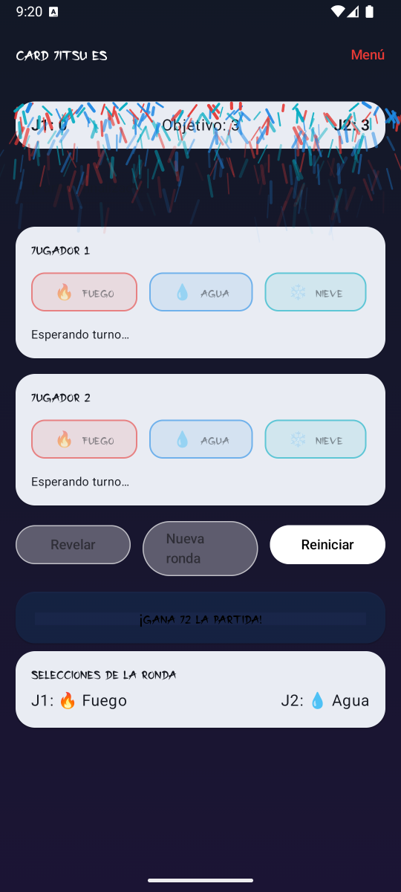
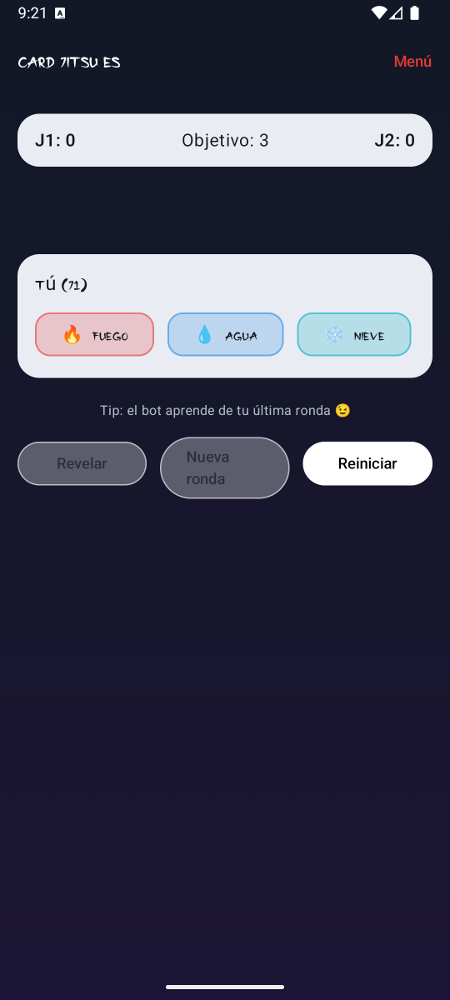

# 🥋 Card Jitsu ES

**Card Jitsu ES** es un mini–juego de estrategia inspirado en el clásico *Card-Jitsu* de Club Penguin, desarrollado en **Kotlin + Jetpack Compose** como proyecto académico.  
Permite jugar en tres modos: **Jugador vs Jugador (local)**, **Jugador vs Bot** con IA adaptativa y **Jugador vs Jugador por Bluetooth**.

---

## 🎮 Características principales

- 🧠 **Lógica de juego estratégica:** fuego vence nieve, nieve vence agua, agua vence fuego.  
- 🧍‍♂️🧍‍♀️ **Modos de juego:**
  - **Local:** dos jugadores en el mismo dispositivo.  
  - **Vs Bot:** un bot que aprende de tus rondas anteriores.  
  - **Bluetooth:** partidas inalámbricas entre dos dispositivos físicos.  
- 🎨 **Interfaz moderna y estilizada:**  
  - Diseño tipo dojo con gradientes oscuros.  
  - Fuente japonesa personalizada (*Japon.ttf*).  
  - Animaciones, feedback háptico y botones con estilo neón.  
- 🧩 **Arquitectura modular:** separación clara entre dominio, presentación y UI.  
- 🧪 **Pruebas unitarias:** reglas de juego validadas con JUnit.

---

## 🧱 Estructura del proyecto

```bash
app/
 ├─ src/
 │   ├─ main/
 │   │   ├─ java/mx/escom/cardjitsu/
 │   │   │   ├─ dominio/        # Reglas, Elementos, ResultadoRonda
 │   │   │   ├─ presentacion/   # ViewModels y lógica de comunicación
 │   │   │   └─ ui/
 │   │   │       ├─ pantallas/  # PantallaMenu, PantallaPartida, PantallaBluetooth
 │   │   │       └─ tema/       # TemaCardJitsu, fuentes, colores y gradientes
 │   └─ test/                   # Pruebas unitarias (ReglasTest.kt)
 ├─ build.gradle.kts
 └─ settings.gradle.kts
```

---

## ⚙️ Tecnologías y dependencias

- **Kotlin 2.0.21**  
- **Jetpack Compose BOM 2024.09.00**  
- **Material3**  
- **AndroidX Lifecycle & Activity Compose**  
- **JUnit 4.13.2**  
- **Gradle 8.13**

---

## 🚀 Ejecución

### 🔹 Modo Local / Vs Bot
1. Abre el proyecto en **Android Studio Koala o posterior**.  
2. Ejecuta en un emulador o dispositivo físico.  
3. En el menú principal selecciona el modo deseado.

### 🔹 Modo Bluetooth

1. Empareja ambos dispositivos desde **Configuración → Bluetooth**.  
2. Inicia el juego en modo “PvP por Bluetooth”.  
3. Uno selecciona **Anfitrión** y el otro **Unirse**.  
4. Al conectarse, comenzará la partida sincronizada.

---

## 🧩 Pruebas unitarias

Ejecuta los tests desde **Android Studio → Run → Run 'All Tests'**

Archivo principal:  
`app/src/test/java/mx/escom/cardjitsu/juego/dominio/ReglasTest.kt`

Ejemplo:

```kotlin
@Test
fun aguaVenceFuego() {
    assertEquals(ResultadoRonda.GANA_J1, Reglas.enfrentar(Elemento.AGUA, Elemento.FUEGO))
}
```

---

## 🎨 Personalización

- **Fuente personalizada:** `Japon.ttf` en `/app/src/main/res/font/`  
- **Gradiente dojo:** definido en `FondoDojo.kt`  
- **Tema principal:** `TemaCardJitsu.kt`

---

## 📸 Capturas de pantalla


| Vista | Imagen |
|-------|--------|
| **Menú principal** |  |
| **Modo local** |  |
| **Ronda ganada** |  |
| **Partida ganada** |  |
| **Modo vs Bot** |  |
| **Bluetooth emparejando jugadores** |  |


---

## 🧑‍💻 Autor

Desarrollado por **Escárcega Hernández Steven Arturo**  y **Contla Mota Luis Andrés**

🎓 Proyecto académico de la materia **Aplicaciones Móviles (ESCOM - IPN)**  
📅 Octubre 2025

---

## 📜 Licencia

Este proyecto es de libre uso académico y educativo.  
Si lo reutilizas, por favor menciona a los autoress original.

---
